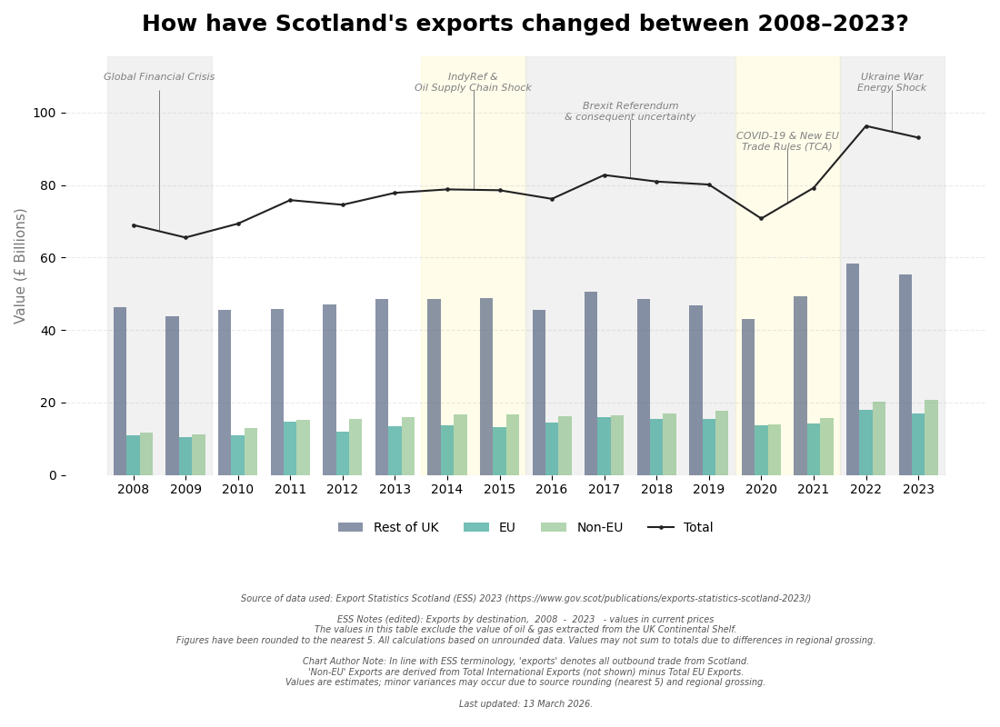

# Draft 1
# Export Statistics Scotland (ESS) Dashboard 2023

An interactive dashboard built with **Shiny for Python** and deployed via **Shinylive** (WebAssembly). This tool visualises Scottish export trends ("exports" as defined by the publishers) to the EU and Non-EU International markets and the Rest of the UK.

## Live Demo (may be slow on first loading)
https://robrodden.github.io/export_statistics_scotland/

## Key Features
* **Interactive Visualisation:** Tracks trade value in £ Billions across three main destination blocks.
* **Contextual Annotations:** Highlights major economic events (Brexit, COVID-19, Ukraine War) using a dynamic "staircase" labeling system.
* **Exportable Chart:** Users can download a high-resolution PDF of the current chart.

## Tech Stack
* **Language:** Python 3.x
* **Framework:** Shiny for Python
* **Deployment:** Shinylive (Serverless/GitHub Pages)
* **Libraries:** Pandas, Matplotlib, Seaborn

## Local Development
To run this project locally:
1. Clone the repo: `git clone <your-repo-url>`
2. Install dependencies: `see requirements.txt`
3. Export the app: `shinylive export . docs`
4. Serve locally: `python3 -m http.server --directory docs --bind localhost 8008`

## REMEMBER TO ADD DEVELOPMENT LOG

# Draft 2
# Scottish Export Destinations Tracker (2008–2023)

### View Live Interactive App](xxxxxxxx)

## The Research Question
**"How have Scottish export destinations changed between 2008–2023?"**

This project explores the evolution of Scotland's trade amidst a series of global "shocks." While the data tracks the shift in international markets, the primary insight discovered was the persistent and overwhelming role of the **Rest of the UK (RUK)** as a destination. 

### Key Insight: The "Shadow Export" Hypothesis
The analysis highlights that a significant portion of "exports to the RUK" may represent transit trade—goods destined for the EU that pass through English logistics hubs (the "Rotterdam Effect"). This nuances the traditional understanding of Scottish trade independence and highlights the deep integration of the UK internal market.

## Technical Implementation
- **Zero-Pandas Runtime:** Optimized for **WebAssembly (Shinylive)**. By moving data processing to a pre-deployment JSON pipeline, the initial load size was reduced from ~35MB to <3MB, ensuring near-instant browser startup.
- **Precision Annotations:** Used **NumPy linear interpolation** (`np.interp`) to dynamically anchor "flagpole" annotations to trend lines, ensuring visual accuracy across multi-year events like Brexit.
- **Sophisticated UX:** Built a side-by-side utility menu featuring a PDF report downloader and direct GitHub source linking using custom CSS-classed UI elements.

## Project Structure
* `app.py`: The high-performance Shiny application.
* `prepare_data.py`: The local ETL (Extract, Transform, Load) script that processes Excel data into JSON.
* `data/processed/clean_ESS_data.json`: The "lean" data source for the live app.
* `requirements.txt`: Minimalist dependencies (Matplotlib, Numpy, Requests, Shiny).

## Quick Preview

---
*Data Source: Scottish Government, Export Statistics Scotland (ESS) 2023.*