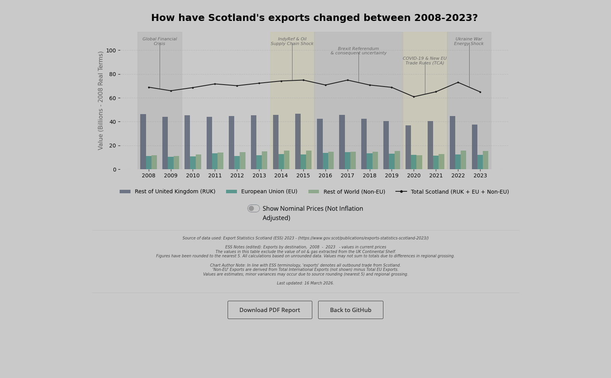

# Draft 1
## Live Demo (may be slow on first loading)
https://robrodden.github.io/export_statistics_scotland/

Scottish Exports Dashboard (2008–2023)
A dynamic, interactive web application built with Shiny for Python to visualize Scotland's export statistics by geographical block. This tool provides insights into trade trends with the Rest of the UK (RUK), the European Union (EU), and the Rest of the World (Non-EU).

Features
Time-Series Visualization: Analysis of trade data from 2008 to 2023.

Inflation Adjustment: A built-in toggle to switch between Real Terms (inflation-adjusted to 2008 prices) and Nominal Prices (current value).

Contextual Events: Automated "staircase" labeling of major economic events (e.g., Global Financial Crisis, Brexit, COVID-19) to see their impact on trade.

Exportable PDF: Generate and download a high-resolution PDF report of the current view.

Live Web Version: Hosted via Shinylive, allowing the app to run entirely in the browser without a backend server.

Tech Stack
Language: Python 3.11+

Web Framework: Shiny for Python

Data Science: NumPy, Pandas (for processing)

Visualization: Matplotlib

Static Hosting: Shinylive & GitHub Pages

Project Structure
/app: Contains the live application code (app.py), UI constants, and the processed JSON data.

/data_processed: The cleaned data source generated from official Scottish Government statistics.

/docs: The static export of the application for web hosting.

requirements.txt: List of dependencies for both the app and data processing.

Local Setup
Clone the repository:

Bash
git clone https://github.com/RobRodden/export_statistics_scotland.git
cd export_statistics_scotland
Create and activate a virtual environment:

Bash
python -m venv venv
# Windows:
.\venv\Scripts\activate
# Mac/Linux:
source venv/bin/activate
Install dependencies:

Bash
pip install -r requirements.txt
Run the app:

Bash
cd app
shiny run --reload app.py
Data Source
Data is sourced from the Export Statistics Scotland (ESS) 2023 publication.
Source: Scottish Government - Export Statistics Scotland